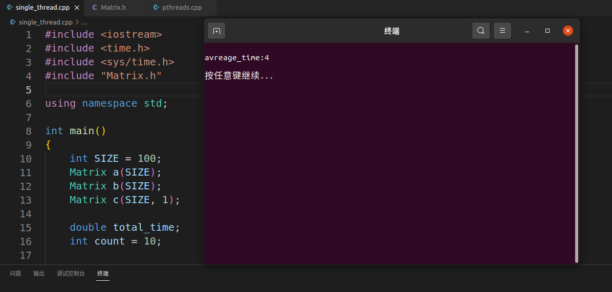

# pthreads加速矩阵乘法

## 一. 环境说明

虚拟机使用VMware® Workstation 16 Pro 16.2.4 build-20089737版本

主机为 Windows 10 Home, 64-bit

镜像为阿里OS镜像 Ubuntu 64位 20.04.5(desktop-amd64)版本

虚拟机分配内存 4G，硬盘 20G，CPU 分配 4核，开发环境为 VS Code，g++编译器

使用 C++ 语言编写
 
 

## 二. 代码思路
矩阵乘法的本质就是for循环相乘再相加，而且各行各列之间并不会产生先后顺序，也没有相互影响，因此为尝试和使用多线程进行并发运算

在本次作业中我并**没有采用数学方法或算法知识**对矩阵运算进行加速，因为本次作业的目的是体验多线程并发的作用，并不是追求极致的复杂度与效率

首先创建一个矩阵类，可以自定义方阵大小，每次生成仿真均为随机生成 0-9 的一个随机数，随机方法为时间随机

计时方面不能采用 clock() 函数进行计时，因为该函数是按照CPU时钟计算，单位甚至是周期个数，因此会将线程生成系统调用的时间全算进去，导致看起来总时间还不如单线程运算。于是我采用了 timeval 方法进行计时。

在常规的单线程运算中，我才用了三重 for 循环来进行直接运算

在多线程运算中，我让每个线程负责若干行的运算工作。经过测试发现，对于 1000 行方阵，计算 10 次计算平均时间，结果如下：
 
 

## 三. 结果展示

### **500线程：**

 

### **200线程：**

 

### **100线程：**

 

### **50线程：**

 

### **40线程：**

 

### **单线程：**

## 可以看到，线程数为10时加速效果最明显，时间最短

我们可以得到以下结论：

1. 多线程并发的确速度更快

2. 如果线程数量过多，由于调用等原因可鞥也会导致速度下降的问题，例如500个线程时速度只有两倍左右

3. 加速的效果取决于CPU核的数量，我的虚拟机分配了4核，因多线程比单线程在理想状态下快了四倍

4. 线程数不代表加速倍数，其倍数上限为CPU核的个数

 

## 后记

我同时还进行了其他 SIZE 大小的矩阵对于多线程计算的效果，结果非常有趣，但我并没有做太多截图，这会影响观感，在此我只写下我个人发现的结论，如有兴趣可以自行尝试测试

1. 方阵越大，多线程加速效果越明显，当大小在100以下时，加速甚至不足两倍
2. 方阵越小，线程过多的副作用就越明显，例如方阵大小100时，速度甚至慢了3倍多

### **单线程：**

 

### **过多线程：**

